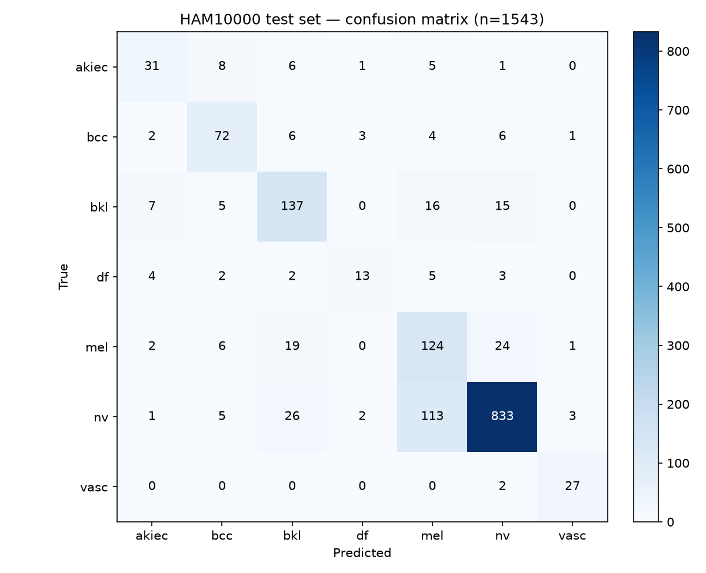
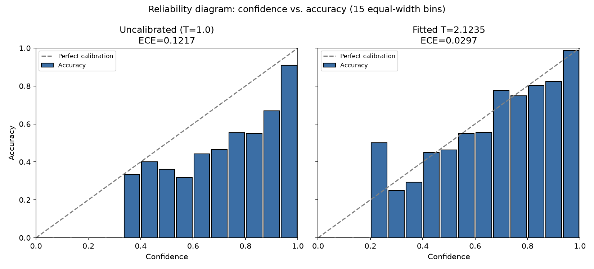

# 🩺 Cancer Fusion AI

> An open-source framework for multimodal medical AI, in active development.

⭐ If this project helps you, please consider starring the repository.
Contributions are welcome!


> The Docker image (`Dockerfile:7`) targets Python 3.12; `runtime.txt` (used by the Procfile/buildpack deploy path) pins Python 3.10 — the two deploy paths currently disagree on version. A `LICENSE` file has not been added to this repo yet, so treat the MIT badge as aspirational (see [Known Limitations](#-known-limitations)).

Research-grade **open-source** multimodal framework for skin cancer classification using deep learning, metadata fusion, and explainable AI.

A multimodal deep learning pipeline for skin lesion classification on the **HAM10000** dataset — combining a CNN image encoder with patient metadata (age, sex, lesion location), and adding a **Grad-CAM explainability layer** so predictions aren't a pure black box. (LLM-generated clinical-report summaries are designed but not implemented — see [Roadmap](#-roadmap--not-yet-implemented).)

Built as an end-to-end, phased project: from an image-only baseline to a fused multimodal model, with an explainability layer and a React frontend on top.

**Topics:** `medical-ai` `pytorch` `deep-learning` `skin-cancer` `multimodal` `computer-vision` `gradcam` `healthcare-ai` `machine-learning` `ai` `research` `open-source`

---

## 🧠 Why this project

Skin cancer classifiers are usually judged only on accuracy. In a clinical-adjacent setting, that's not enough — a model needs to show **what** it looked at and **why**, and it needs to fold in the kind of context (age, sex, lesion site) that a real clinician would use. This project treats explainability as a first-class feature, not an afterthought.

---

## ❤️ Why Open Source?

Cancer Fusion AI is developed as an open-source project to make reproducible medical AI workflows accessible to students, researchers, and developers worldwide. The goal is to encourage collaboration, transparency, reproducible research, and community-driven improvements.

---

## 🏗️ Architecture

**Phase 1 — Image-only baseline**
ResNet50 as the feature extractor, fine-tuned on HAM10000's 7 diagnostic classes. The code supports ImageNet-pretrained initialization (`src/model.py:34-39`), but the shipped config now sets `pretrained: false` (`configs/config.yaml:20`) — the served checkpoint fully covers the model's `state_dict`, so pretrained weights would only be downloaded and then immediately overwritten. Pretrained init is still there for anyone training a fresh model from scratch.

**Phase 2 — Metadata fusion**
Patient metadata (age, sex, anatomical site) is processed through a small MLP and concatenated with the image embedding before the final classifier head — so the model reasons over pixels *and* clinical context together.

```
Image ──► ResNet50 (encoder) ──► image_features (2048-d)
                                            │
Metadata ──► MLP (128 → 64) ──► meta_features (64-d)
                                            │
                                    concat + classifier head
                                            │
                                      7-class logits
```

**Phase 3 — Explainability layer (partially implemented)**
- ✅ **Grad-CAM** on the final conv block of the ResNet50 encoder (`app.py:103-131`), producing a heatmap over the exact regions that drove each prediction. Exposed via `/predict`'s `explain` query param — see [Known Limitations](#-known-limitations).
- 🚧 **LLM-generated clinical reports** — designed, not implemented. See [Roadmap](#-roadmap--not-yet-implemented).

**Phase 4 — Evaluation deep-dive** ✅
- `src/error_analysis.py` — per-class precision/recall/F1 and a confusion matrix on the held-out test set, with melanoma/BCC/AKIEC called out explicitly rather than averaged away in macro-F1.
- `src/calibrate.py` — post-hoc temperature scaling (Guo et al., 2017): fits a single scalar `T` on the validation set by NLL minimization, then reports ECE/MCE/NLL on test at `T=1.0` (uncalibrated), the old hand-picked `T=2.5`, and the fitted `T`.
- See [Results](#-results) and [Limitations](#-limitations) below.

---

## 📊 Dataset

[HAM10000 ("Human Against Machine")](https://www.kaggle.com/datasets/kmader/skin-cancer-mnist-ham10000) — ~10,000 dermatoscopic images across 7 classes:

| Code | Diagnosis |
|------|-----------|
| `akiec` | Actinic keratoses / intraepithelial carcinoma |
| `bcc` | Basal cell carcinoma |
| `bkl` | Benign keratosis-like lesions |
| `df` | Dermatofibroma |
| `mel` | Melanoma |
| `nv` | Melanocytic nevi |
| `vasc` | Vascular lesions |

The dataset is heavily imbalanced (`nv` ≈ 67% of samples, measured from `data/HAM10000_metadata.csv`) — handled via inverse-frequency class weighting (`src/dataset.py:252-266`, used in `src/train.py:126-129`).

**Split strategy:** stratified split **by `lesion_id`**, not by image, since some lesions have multiple photos. This prevents the same lesion's images from leaking across train/val/test (`src/dataset.py:209-225`). Configured as train/val/test = 0.7/0.15/0.15 with `random_seed: 42` (`configs/config.yaml:13-16`); on the current metadata CSV this yields a 1,543-image test set — see [Results](#-results).

---

## ⚙️ Setup

```bash
git clone https://github.com/Avnish1505/cancer-fusion-ai.git
cd cancer-fusion-ai
pip install -r requirements.txt
```

Download the [HAM10000 dataset](https://www.kaggle.com/datasets/kmader/skin-cancer-mnist-ham10000) and update the paths in `configs/config.yaml`:

```yaml
data:
  metadata_csv: "path/to/HAM10000_metadata.csv"
  images_dir_part1: "path/to/HAM10000_images_part_1"
  images_dir_part2: "path/to/HAM10000_images_part_2"
  train_split: 0.7
  val_split: 0.15
  test_split: 0.15

model:
  backbone: "resnet50"      # or "efficientnet_b0"
  num_classes: 7
  pretrained: false          # true only makes sense if you don't have a checkpoint yet
  dropout: 0.3

train:
  use_metadata: true
  image_size: 224
  batch_size: 32
  num_epochs: 50
  learning_rate: 0.0001
  early_stopping_patience: 10
  use_class_weights: true
  device: "cuda"
```

> ⚠️ The `configs/config.yaml` shipped in this repo currently has **two top-level `train:` blocks**. YAML does not error on duplicate top-level keys — it silently keeps only the last one, so the first block's values are dead. This should be cleaned up; until it is, only the second `train:` block (the one matching the example above) actually takes effect.

### Train

```bash
python -m src.train --config configs/config.yaml
```

Trains with early stopping (patience-based on val macro-F1), saves the best checkpoint to `paths.checkpoint_dir/best_model.pt` (`./checkpoints/best_model.pt` by default, `configs/config.yaml:36`).

### Evaluate

```bash
python -m src.evaluate --config configs/config.yaml --checkpoint checkpoints/best_model.pt
```

`--checkpoint` is required (`src/evaluate.py:146`) — running the command without it will fail with an argparse error. For the fuller per-class breakdown reported in [Results](#-results), use `src/error_analysis.py` instead (below).

### Calibrate + error-analyze

```bash
python -m src.calibrate --checkpoint models/best_model.pt \
    --images-dir-part1 /path/to/HAM10000_images_part_1 \
    --images-dir-part2 /path/to/HAM10000_images_part_2
python -m src.error_analysis
```

`calibrate.py` runs the model once over val and test and caches the raw logits to `reports/calibration/cache/` (`.pt` files, checked into this repo so the numbers below are reproducible without re-running inference). `error_analysis.py` is read-only — it only reads that cache, never touches the model or checkpoint — and (re)writes `reports/confusion_matrix.png`. Both scripts share the same `stratified_split()` as training/evaluation, so the split is identical.

### Running the inference API

`app.py` serves the trained model over HTTP: `GET /health`, `GET /readyz`, and `POST /predict`. It loads `models/best_model.pt` (`app.py:80`), which is a **separately-trained, ready-to-serve checkpoint tracked with Git LFS** — it is *not* the same file `python -m src.train` produces above (that goes to `./checkpoints/best_model.pt`, a different path). Before running the API from a fresh clone:

```bash
git lfs install
git lfs pull
```

Without this, `models/best_model.pt` is left as an LFS pointer stub and the API will fail to start when it tries to load it (`app.py:80`).

Then either run it directly:

```bash
uvicorn app:app --host 0.0.0.0 --port 8000
```

or via Docker — note the checkpoint is **volume-mounted, not baked into the image** (see [Known Limitations](#-known-limitations)):

```bash
docker compose up
```

### Frontend

`frontend/` is a React + Vite single-page app that uploads an image, calls the backend's `/predict`, and renders the prediction, per-class probabilities, and the Grad-CAM overlay as a three-section report.

```bash
cd frontend
npm install
cp .env.example .env   # then edit VITE_API_BASE_URL, see below
npm run dev
```

The backend URL is read from `VITE_API_BASE_URL` (`frontend/src/App.jsx:4`), a Vite env var:

```
# frontend/.env
VITE_API_BASE_URL=http://127.0.0.1:8000
```

If `VITE_API_BASE_URL` is unset, the app falls back to a hardcoded Railway URL baked into `frontend/src/App.jsx:4` and `frontend/.env.example` — **that fallback is not a maintained live demo**; this project's backend is not currently deployed anywhere, and the fallback should not be relied on. Always set `VITE_API_BASE_URL` explicitly to a backend you're running yourself (e.g. the `uvicorn` command above). `frontend/vite.config.js` and CORS in `app.py` are set up for the default Vite dev server ports (`localhost:5173` / `127.0.0.1:5173`).

`npm run build` produces a static `frontend/dist/` you can serve or deploy separately from the backend.

---

## 📈 Results

Phase 2 (image + metadata fusion), ResNet50 backbone, evaluated on the held-out, `lesion_id`-stratified **test set (n=1,543)** using the shipped checkpoint `models/best_model.pt`.

### Overall

| Metric | Value |
|---|---|
| Test accuracy | **0.8017** |
| Test macro-F1 | **0.7120** |
| Majority-class baseline (always predict `nv`) | accuracy 0.6371, macro-F1 0.1112 |
| Best validation macro-F1 (training) | 0.726 — `models/best_model.pt`'s stored `best_val_metric` is `0.7261930300561489`, `epoch=25` |

The majority-class baseline matters here: `nv` is ~64% of the test set, so a trivial always-`nv` classifier already scores 0.6371 accuracy. The fusion model's 0.8017 accuracy is a real improvement, but its macro-F1 (0.7120, vs. 0.1112 for the baseline) is the more honest read of per-class performance on an imbalanced dataset.

### Per-class (test set, sorted by recall ascending — reproduced live via `python -m src.error_analysis`)

| Class | Precision | Recall | F1 | Support |
|---|---|---|---|---|
| `df` (Dermatofibroma) | 0.6842 | 0.4483 | 0.5417 | 29 |
| `akiec` (Actinic keratoses / IEC) | 0.6596 | 0.5962 | 0.6263 | 52 |
| `mel` (Melanoma) | 0.4644 | 0.7045 | 0.5598 | 176 |
| `bkl` (Benign keratosis-like) | 0.6990 | 0.7611 | 0.7287 | 180 |
| `bcc` (Basal cell carcinoma) | 0.7347 | 0.7660 | 0.7500 | 94 |
| `nv` (Melanocytic nevi) | 0.9423 | 0.8474 | 0.8923 | 983 |
| `vasc` (Vascular lesions) | 0.8438 | 0.9310 | 0.8852 | 29 |



### Calibration (test set, `src/calibrate.py`)

Temperature scaling divides logits by a positive scalar before softmax, so it cannot change argmax, predictions, accuracy, macro-F1, or the confusion matrix above — it only reshapes the reported confidence distribution.

| Temperature | ECE | MCE | NLL | Top-1 Acc | Macro-F1 |
|---|---|---|---|---|---|
| T=1.0 (uncalibrated) | 0.1217 | 0.2825 | 0.6991 | 0.8017 | 0.7120 |
| T=2.5 (previous hand-picked value) | 0.0232 | 0.2446 | 0.5344 | 0.8017 | 0.7120 |
| **T=2.1235 (fitted on validation via NLL minimization, current)** | 0.0297 | 0.2357 | 0.5220 | 0.8017 | 0.7120 |



The fitted `T=2.1235` is what `app.py:107` (`TEMPERATURE = 2.1235`) actually serves. It was chosen by minimizing NLL on the validation set (never the test set), then reported here on test for transparency, alongside the old hand-picked `T=2.5` it replaced. Fitted `T` improves NLL and MCE over the hand-picked value, but is very slightly worse on test-set ECE (0.0297 vs. 0.0232) — see [Limitations](#-limitations).

---

## ⚠️ Limitations

- **Melanoma recall is 70.45%** — 52 of 176 true melanoma cases in the test set are missed (predicted as `nv`: 24, `bkl`: 19, `bcc`: 6, `akiec`: 2, `vasc`: 1). Roughly more than 1 in 5 true melanomas would be missed if this model's top-1 prediction were relied on alone.
- **The missed melanomas are often confident, not hesitant.** On the 52 missed melanoma cases, the model's mean calibrated confidence in its (wrong) top prediction is 59.6% (median 55.5%, max 99.1%) — it frequently misses with real confidence rather than a visible "unsure" signal, which is the more dangerous failure mode of the two for a screening use case.
- **Melanoma precision is low (0.4644)** — of everything the model calls melanoma, well under half actually is; the rest is mostly `bkl` and `nv` being over-flagged as `mel`. A deployment optimizing for melanoma recall would need to account for this precision/recall trade-off explicitly (e.g. via thresholding), not just report recall in isolation.
- **The test set has a small melanoma sample (n=176 of 1,543 total).** The 70.45% recall estimate carries real sampling noise and is not reported here with a confidence interval; treat it as a point estimate from one held-out split, not a precise clinical figure.
- **Calibration is slightly under-confident in the dominant (highest-confidence) prediction bin after fitting.** At the fitted `T=2.1235`, the top confidence bin (`[0.93, 1.0]`, 669 of 1,543 test predictions — mostly correctly-classified `nv`) reports ~98.4% mean confidence against ~98.7% actual accuracy in that bin: a small but real under-confidence, in the bin holding the most probability mass. Mid-confidence bins show a mix of over- and under-confidence in both directions. Net effect: fitted `T` beats uncalibrated on all three calibration metrics, and beats the old hand-picked `T=2.5` on NLL and MCE, but is marginally worse than `T=2.5` on test-set ECE — `T` was fit on validation, not test, so some val→test generalization gap is expected.
- **Training data is predominantly light-skinned.** HAM10000's source documentation describes it as collected primarily from patients in Austria and Australia, skewed toward lighter Fitzpatrick skin types. This repo's own metadata (`data/HAM10000_metadata.csv`) does not record skin tone, so this can't be verified or quantified from the data used here — it's a known characteristic of the source dataset, not something measured in this repo. Expect degraded and unquantified performance on darker skin tones.
- **No out-of-distribution detection.** Nothing in `app.py` or the model checks whether an uploaded image resembles a dermatoscopic lesion image at all — a photo of anything else is still routed through the same 7-way softmax and returns a confident-looking prediction.

---

## 🔍 Explainability in action

Each prediction is paired with a **Grad-CAM heatmap** localizing the image regions the model relied on (`app.py:103-131`).

LLM-generated report summaries contextualizing a prediction in plain language are **designed but not implemented** — see [Roadmap](#-roadmap--not-yet-implemented). An earlier version of this README included an illustrative example of what such a report might say (quoting a "100.0% confidence" prediction); it was not real model output, documented a since-fixed softmax-saturation bug in an earlier checkpoint, and has been removed to avoid implying working code that doesn't exist.

---

## 🗂️ Project structure

```
cancer-fusion-ai/
├── app.py                     # FastAPI service: /health, /readyz, /predict (Grad-CAM + explain toggle)
├── Dockerfile
├── docker-compose.yml          # mounts models/ and data/ as volumes — see Known Limitations
├── Procfile
├── preflight_check.py          # startup sanity checks
├── src/
│   ├── config.py               # YAML config loader + validation
│   ├── dataset.py               # HAM10000Dataset, lesion_id-stratified split, class weights
│   ├── model.py                  # CancerImageClassifier (image + metadata fusion)
│   ├── transforms.py             # train/eval augmentation pipelines
│   ├── train.py                   # training loop, early stopping, checkpointing
│   ├── evaluate.py                 # held-out evaluation (classification report + confusion matrix)
│   ├── calibrate.py                 # post-hoc temperature scaling (Guo et al. 2017), val-fit/test-report
│   ├── error_analysis.py             # per-class + melanoma/BCC/AKIEC error breakdown, reads calibrate.py's cache
│   └── utils.py                       # seeding, device selection, checkpoint I/O
├── configs/
│   ├── config.yaml
│   └── local_config.yaml
├── models/
│   └── best_model.pt          # Git LFS — see "Running the inference API" above
├── data/
│   └── HAM10000_metadata.csv
├── reports/
│   ├── confusion_matrix.png              # from src/error_analysis.py
│   └── calibration/
│       ├── reliability_diagram.png       # from src/calibrate.py
│       └── cache/                        # cached val/test logits+labels (.pt), for reproducible reporting
├── scripts/
│   └── setup_data.sh
├── tests/
│   ├── smoke_test.py
│   └── edge_case_test.py
├── frontend/                   # React + Vite SPA — see "Frontend" under Setup
│   ├── src/
│   │   ├── App.jsx              # upload → /predict → results UI
│   │   ├── App.css
│   │   ├── index.css
│   │   └── main.jsx
│   ├── .env.example             # VITE_API_BASE_URL
│   ├── package.json
│   └── vite.config.js
├── requirements.txt
├── runtime.txt
└── README.md
```

> `LICENSE`, `CONTRIBUTING.md`, `CODE_OF_CONDUCT.md`, `SECURITY.md`, `CHANGELOG.md`, and `notebooks/explainability_demo.ipynb` were referenced in an earlier version of this README and this tree, but none of them exist in this repo (working tree or git history) — see [Roadmap](#-roadmap--not-yet-implemented).

---

## 🛠️ Tech stack

**Backend:** `PyTorch` · `torchvision` (ResNet50) · `scikit-learn` (splitting, metrics, calibration) · `OpenCV` (Grad-CAM overlay) · `FastAPI` / `uvicorn` (serving) · `pandas` / `NumPy` · `matplotlib` (reports)
**Frontend:** `React` · `Vite`

---

## 📶 Performance

Measured locally — **not production-deployment numbers**: single uvicorn worker, CPU only, one machine, one request at a time, warm process (post cold-start), 5 runs each, same input image.

| Phase | `/predict` (`explain=true`, default) | `/predict?explain=false` |
|---|---|---|
| image_decode | ~0.4ms | ~0.4ms |
| preprocess | ~1.0ms | ~1.0ms |
| forward_and_backward | ~95-98ms | ~29-33ms |
| heatmap_render | ~1.1-1.2ms | 0ms (skipped) |
| serialize | ~0.8-0.9ms | ~0.02-0.06ms |
| **approx. total** | **~100ms** | **~31ms** |

Cold start (process import to first servable request), single worker: **~9.8s**.

These numbers characterize *where* per-request time goes on one local run, not what to expect under concurrent production traffic, on the actual deployment target, or with a GPU. There is currently no deployed instance of this backend to measure in production — see [Frontend](#frontend) above.

---

## ⚠️ Known Limitations

- **Cold start ≈ 9.8s locally (single worker, CPU).** Dominated by boot-time work in `app.py` at import: loading the full metadata CSV (`app.py:56`), recomputing the stratified train/val/test split (`app.py:57-67`) and re-fitting the age `StandardScaler` (`app.py:68-69`) on every process start, then building the model and loading the ~289MB checkpoint (`app.py:79-82`). None of this is cached across restarts.
- **Grad-CAM's backward pass is the dominant per-request cost.** `/predict` (Grad-CAM on, default) runs a full forward + backward pass plus heatmap rendering; `/predict?explain=false` skips all of that and runs a plain forward pass under `torch.inference_mode()`. Measured locally, that's the difference between ~100ms and ~31ms per request (see Performance above). Use `explain=false` when only the classification result is needed.
- **The shipped checkpoint (`models/best_model.pt`) is Git LFS-tracked and is *not* copied into the Docker image.** `Dockerfile` only creates an empty `models/` directory; the real checkpoint arrives via the `docker-compose.yml` volume mount. A container built and run without that mount (or without `git lfs pull` beforehand in whatever deploy path supplies the file) will fail at startup when it tries to load `models/best_model.pt`.
- **Training and serving disagree on checkpoint location.** `python -m src.train` writes to `paths.checkpoint_dir` (`./checkpoints/best_model.pt` by default, `configs/config.yaml:36`); `app.py:80` hardcodes `models/best_model.pt`. Retraining locally does not automatically update what the API serves — you'd need to copy the new checkpoint over.
- **`configs/config.yaml` has two top-level `train:` blocks.** YAML silently keeps only the last one (PyYAML doesn't error on duplicate keys), so the first block's values are dead code in the file. Not a runtime bug today (the second block happens to be the intended one), but misleading to read.
- **LLM-generated clinical report summaries are not implemented.** See [Roadmap](#-roadmap--not-yet-implemented).
- **No backend is currently deployed.** The frontend's `VITE_API_BASE_URL` fallback points at a Railway URL, but that is not a maintained live demo — see [Frontend](#frontend). Run the backend yourself to use the frontend.

For model-quality and dataset limitations (melanoma recall, calibration, skin-tone coverage, OOD), see [Limitations](#-limitations) above.

---

## 🚧 Roadmap / Not Yet Implemented

Product roadmap:
- [x] **Phase 4** — Model evaluation deep-dive: per-class precision/recall/confusion matrix, error analysis on misclassified melanoma cases (highest clinical stakes) — implemented (`src/error_analysis.py`, `src/calibrate.py`)
- [ ] **Phase 5** — Lightweight deployment: Gradio/Streamlit demo for interactive upload → prediction → Grad-CAM → report
- [ ] **LLM-generated clinical report summaries** — designed, not implemented. No NVIDIA NIM / OpenAI code exists anywhere in this repo's working tree or git history; `openai` sits unused in `requirements.txt`. A previous README version showed an illustrative example report as if it were real output — it wasn't, and has been removed.
- [ ] **Explainability demo notebook** (`notebooks/explainability_demo.ipynb`) — referenced in earlier docs, never actually committed to this repo.
- [ ] **Out-of-distribution detection** — nothing currently flags a non-lesion image before it's fed through the classifier; see [Limitations](#-limitations).
- [ ] **A deployed, publicly reachable backend** — the frontend currently has no live backend to talk to by default; see [Known Limitations](#-known-limitations).

Repo housekeeping (referenced elsewhere in this README, not yet added):
- [ ] `LICENSE` — the MIT badge above is aspirational until this exists
- [ ] `CONTRIBUTING.md`
- [ ] `CODE_OF_CONDUCT.md`
- [ ] `SECURITY.md`
- [ ] `CHANGELOG.md`

Longer-term:
- [x] Docker deployment — implemented (`Dockerfile`, `docker-compose.yml`, `Procfile`)
- [x] FastAPI APIs — implemented (`app.py`: `/health`, `/readyz`, `/predict`)
- [x] Frontend — implemented (`frontend/`, React + Vite)
- [ ] CI/CD
- [ ] Hugging Face demo
- [ ] ONNX export
- [ ] Mobile inference
- [ ] Better explainability
- [ ] Benchmarking

---

## 🤝 Contributing

Contributions are welcome! You can contribute by:

- Improving documentation
- Reporting bugs
- Fixing issues
- Improving model performance
- Adding explainability techniques
- Improving deployment

Please open an Issue before submitting major Pull Requests. This repo doesn't yet have `CONTRIBUTING.md` / `CODE_OF_CONDUCT.md` / `SECURITY.md` / `CHANGELOG.md` (see [Roadmap](#-roadmap--not-yet-implemented)) — for now, an Issue is the best way to coordinate before a big change.

---

## 📄 License

This project intends to use the MIT License, but **no `LICENSE` file has been added to this repo yet** (see [Roadmap](#-roadmap--not-yet-implemented)). Treat the badge at the top of this README as aspirational until that's fixed.

---

## ⚠️ Disclaimer

This is a research and educational project. It is **not** a certified medical device and must **not** be used for real clinical diagnosis or treatment decisions. All outputs should be verified by a qualified healthcare professional.

---

## ⭐ Support

If you find this repository useful:

- ⭐ Star the repository
- 🍴 Fork it
- 🐛 Report issues
- 💡 Suggest new features

Your support helps this project reach more students, researchers, and developers.

---

## 👤 Author & Maintainer

**Avnish Singh** — AI/ML Engineer, B.Tech CSE, Babu Banarasi Das University
Primary Maintainer of Cancer Fusion AI · Co-author, ADG 2026 International Conference (AI in Legal Technology)

[LinkedIn](https://www.linkedin.com/in/avnish-singh-a94772309) · [Portfolio](https://website-bzc5.vercel.app/)
